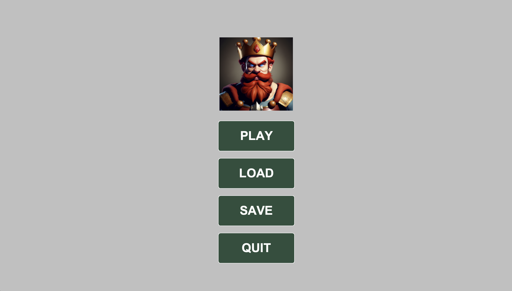
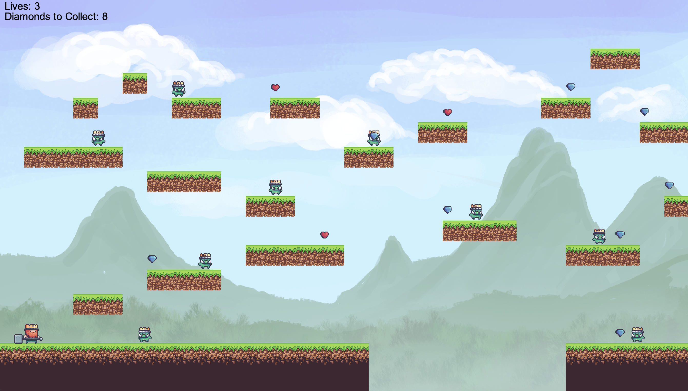
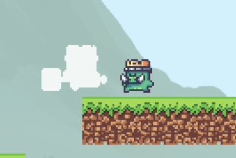
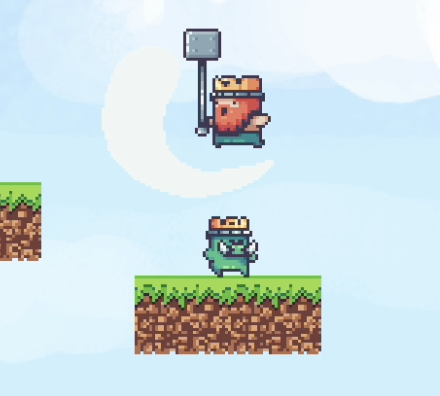
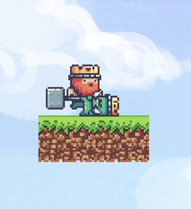

# Semestrální práce - Platformová skákací hra

## Stručný popis
Náplň mojí semestrální práce bude platformová skákací hra inspirovaná tituly jako Mario nebo Manic Miner. Hráč bude ovládat hlavního hrdinu, který se bude pohybovat po různých úrovních, sbírat předměty a porážet nepřátele. Úrovně budou různě tvarované, od rovných lineárních úrovní až po více komplikované úrovně s různými překážkami a nástrahami.

## Hlavní rysy
- **Sběr předmětů:** Hráč bude moci sbírat různé předměty, jako jsou mince nebo jiné bonusy, které mu pomohou získat vyšší skóre nebo lépe se vypořádat s nepřáteli.
- **Boj:** K poražení nepřátel bude muset hráč skočit na jejich hlavu, stejně jako ve hře Mario.
- **Pohybové schopnosti:** Hráč bude mít k dispozici několik různých pohybů, včetně běhu, skákání a padání, které mu pomohou překonat různé překážky a nástrahy na úrovních.

## Technické požadavky
- Dokladovatelný progres projektu na GitLabu.
- Projekt bude v Mavenu.
- Rozumné použití vláken.
- Několik netriviálních tříd bude pokryto unittesty.
- Použití loggerů.
- **Javadoc:** Veškeré public prvky v programu musí mít smysluplný Javadoc.
- **Kód:** Vhodně okomentovaný.
- **Návod/Popis:** Na wiki FEL GitLabu musí být návod na používání programu (uživatelský manuál) a popis programu.
- **Jazyk:** Všechno kromě dokumentace na GitLabu musí být v angličtině.

## Herní Engine
- **Cíl:** Není vytvořit hru jako takovou, ale engine na tvorbu této hry.
- **Načítání předmětů:** Hra bude umět načítat seznam předmětů ze souboru.
- **Ukládání:** Na konci hry bude umět hra uložit seznam předmětů ve stejném formátu.
- **Popis levelů:** Každý level bude popsaný v externím souboru v rozumném formátu.

## Menu
- **PLAY:** Začne hrát samotnou hru.
- **LOAD:** Načíst.
- **SAVE:** Uložit.
- **QUIT:** Vypnout hru.

## Ovládání
- Hra se bude moci ovládat pouze klávesami "A", "D", "Mezerník". 
  - **A D:** Pohyb doprava a doleva.
  - **Mezerník:** Skok.

## Mince
- Hráč bude moci sbírat bonusy ve formě diamantů, které budou potřeba posbírat všechny, za účelem dokončení levelu a zvýšení hráčovo skóre.

## Životy
- Různě po mapě budou také rozmístěny životy, které po sebrání zvýší hráčův celkový počet životů o 1.

## Boj
- Ve hře bude možnost zabít nepřítele jediným způsobem, jimž je skok na jeho hlavu. V případě, že se příšera hráče dotkne, budou mu odečteny životy a v případě, že hráč nemá životy, žádné zemře.

## **Uživatelský manuál**
[Click](https://github.com/thephenom00/Java-Herni-Engine/files/11860332/PJV.-.uzivatelska.prirucka.pdf) 
 

## Ukázka hry ##
 \
 \
 \
 \

